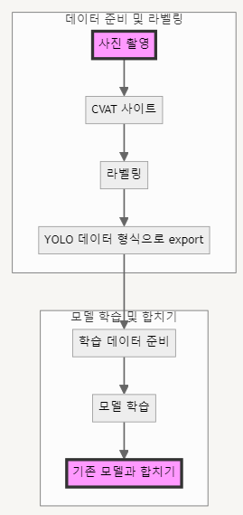

## 커스템 데이터 셋 학습하기
- 목적 : 작품을 인식하기 전 테스트 형식으로 립밤을 이용해 사진을 학습시켜서 인식할 수 있도록 만들기.
1. 사진준비
2. 사진을 레이블로 감싸서 인식할 부분을 데이터셋화 시키기
    1. https://www.cvat.ai/
    2. 여기서 task를 추가하고 add lable을 하고 내가 학습시킬 것을 정한다.
    3. 직접 네모로 감싸주면서 설정을 해준다.
    4. 저장 후 export를 하고 파일 형식을 yolo로 하여서 txt형식의 파일로 네모를 친 좌표를 찾아낸다.
    5. train 폴더를 만들고 images와 lable로 폴더를 나눈다. 그리고 images에는 이미지 파일들을 넣고 lable에는 txt로 된 파일들을 넣는다. config.yaml 파일을 만들고 아래 코드를 작성한다.(립밤을 학습시킨 예제)
    
    ```
    path: C:\Users\SSAFY\Desktop\yolov8 train
    train: images/train
    val: images/train
    
    names:
      0: lib balm
    ```

## 커스템 데이터와 기본모델(기본 객체 인식) 합치기
- runs 파일 안에 best.pt 파일과 yolov8n.pt 파일의 모델을 같이 실행시킨다.

## flow
