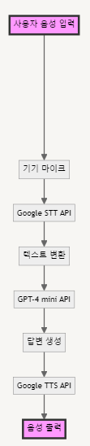

## 목적
- 로봇과 사용자가 음성으로 자연스러운 대화를 하고 로봇의 안내서비스를 음성으로 자연스럽게 안내 받을 수 있도록 생성형 AI를 이용한 chatbot 만들기

## Google Cloude API(STT, TTS 사용)
- 사용자 서비스 키를 json 파일로 만들어서 이용

## GPT-4o-mini API 이용
- 자연스러운 대화를 위한 api 이용

## Flow

## 전시회 prompting을 테스트 하기 쉽도록 text로만 대화하는 onlytext.py

## 음성대화까지 포함한 aichatbot.py 

## USB스피커, USB 마이크를 이용한 음성대화 RPIchatbot.py
- 특정 오디오 모듈 추가 방법
`sudo modprobe snd_bcm2835`
`sudo lsmod | grep snd_bcm2835`  
- 기본오디오 설정
`$ nano ~/.asoundrc`  
- 아래 내용 추가  
defaults.pcm.card 2  
defaults.ctl.card 2  

- 테스트
> 3번 기기가 스피커일시 hw:3  
>  `speaker-test -D hw:3,0 -c 2 -twav -l 3`  
> 레이트를 48000으로 설정시 speaker-test -D hw:3,0 -c 2 -r 48000 -twav -l 3  